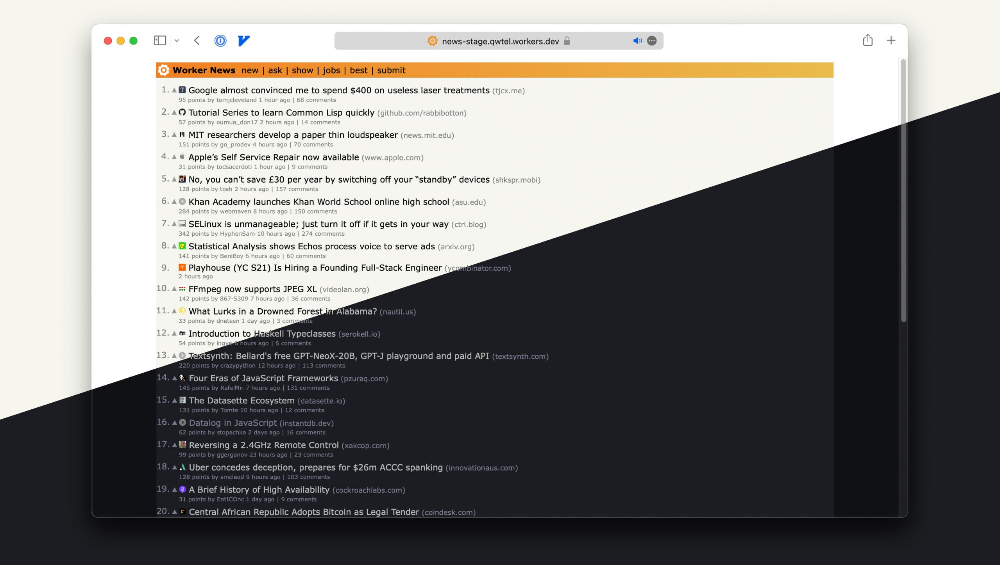

# Worker News

A drop in replacement for Hacker News with support for dark mode, quotes in comments, user identicons and submission favicons. 

## What's cool about this?
- Developed against a generic [Worker Runtime](https://workers.js.org) so that it can run on Cloudflare Workers, Deno Deploy and even the browser's Service Worker.
- Can be installed + offline support: Same code that runs on the edge powers the PWA.
- Everything is stream/async generator-based: API calls, HTML scraping, HTML responses, even JSON stringification and parsing.
- Supports 3 API backends: HTML scraping from news.ycombinator.com, HTTP requests to HN API and HN API via Firebase.
- Built using my own web framework, [Worker Tools](https://workers.tools), which is specifically developed to run across CF Workers, Deno and Service Workers.

## Notes
- The PWA is optional. This app is just HTML streamed from the edge. If the PWA is installed, it is JSON streamed from the edge + HTML streamed from the Service Worker.
- PWA requires latest browsers. FF only works when `TransformStream`s are enabled in in about:config.
- A side effect of this approach is very low TTFB. This version feels faster than HN itself, even when it might be slower.
- Not everything that HN supports is supported by the HN API. The HN API is missing many properties, such as # of descendants of a comment and comment quality (used to gray out downvoted comments). The HTML scraping API doesn't have this problem, but it quickly runs into a scrape shield, especially for infrequently requested sites. Works well when running on your own machine though (scrape shield seems to be more forgiving for new IPs).

## Development
You can run the worker locally either via Wrangler, Node+Miniflare or Deno CLI. 
For Node/Wrangler it's best to install dependencies via `pnpm` (lockfile checked in), but npm or yarn is probably fine too. 

Then run `npm start` and open <http://localhost:8787>.
If you have Wrangler 2.0 is installed, run `wrangler dev --local` instead.

Deno users can simply run `deno task serve` and open <http://localhost:8000>. 

### Note on Running on Cloudflare Workers
While the app runs fine with Miniflare/`wrangler dev --local`, it works poorly when running on Cloudflare's edge network. 
The reason is that the HN API is not usable from CF Workers. Firebase is missing dependencies in the runtime (probably WebSocket or similar), 
while the REST API runs into CF Workers' 50 subrequest limit. 
This only leaves the DOM API (HTML scraping), which usually triggers HN's scrape shield...

